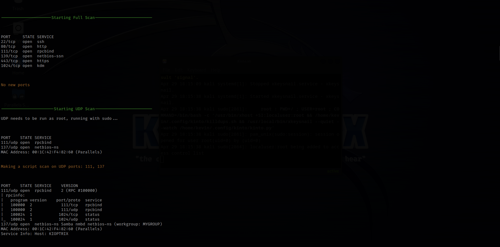
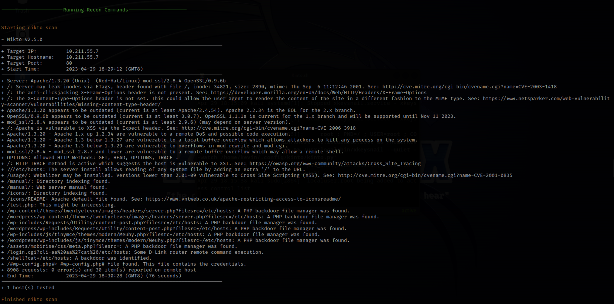
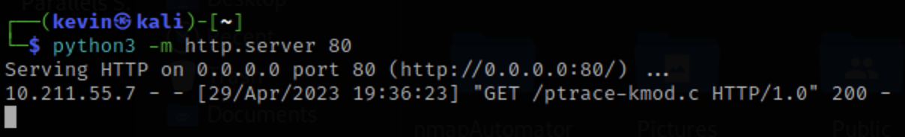
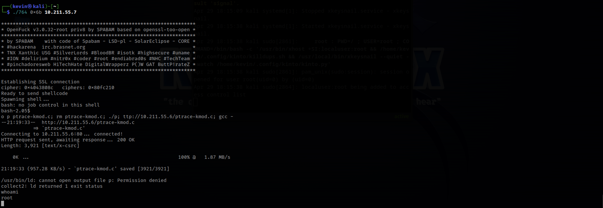

# Kioptrix Level 1

This Kioptrix VM Image are easy challenges. The object of the game is to acquire root access via any means possible (except actually hacking the VM server or player). The purpose of these games are to learn the basic tools and techniques in vulnerability assessment and exploitation. There are more ways then one to successfully complete the challenges.

## Information gathering

The IP address of the Kioptrix VM is: **10.211.55.7**

## Service enumeration

| Server IP   | Address Ports                                      | Open Service/Banner                                                                           |
| ----------- | -------------------------------------------------- | --------------------------------------------------------------------------------------------- |
| 10.211.55.7 | TCP: 22, 80, 111, 139, 443, 1024 UDP: 111, 137 | OpenSSH 2.9p2 Apache httpd 1.3.20 mod_ssl/2.8.4 OpenSSL/0.9.6b rpcbind Samba smbd |

## Penetration

**Vulnerability Exploited:** CVE-2002-0082 (Remote Buffer Overflow)

**System Vulnerable:** 10.211.55.7

**Vulnerability Explanation:** The dbm and shm session cache code in mod_ssl before 2.8.7-1.3.23, and Apache-SSL before 1.3.22+1.46, does not properly initialize memory using the i2d_SSL_SESSION function, which allows remote attackers to use a buffer overflow to execute arbitrary code via a large client certificate that is signed by a trusted Certificate Authority (CA), which produces a large serialized session.

**Privilege Escalation Vulnerability:** Use of a local root exploit for ptrace/kmod that exploits a race condition which creates a kernel thread in an insecure manner.

**Vulnerability Fix:** Update Apache to the latest version

**Severity:** High

**Information Gathering:**

*Full Nmap scan of all ports using nmapAutomator*

*Nikto scan on port 80*

*Searching Exploit-DB for mod_ssl 2.8.7’s vulnerability*

The exploit was downloaded from [here](https://www.exploit-db.com/exploits/47080). It has been modified to [download](https://dl.packetstormsecurity.net/0304-exploits/ptrace-kmod.c) a version of ptrace-kmod.c hosted on the attacker's machine.

The script has been compiled and executed with 0x6b option for RedHat Linux 7.2 (apache-1.3.20-16). Priviledge escalation has been successful obtained.
