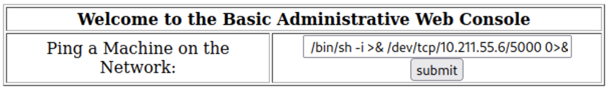

# Kioptrix Level 2

This Kioptrix VM Image are easy challenges. The object of the game is to acquire root access via any means possible (except actually hacking the VM server or player). The purpose of these games are to learn the basic tools and techniques in vulnerability assessment and exploitation. There are more ways then one to successfully complete the challenges.

## Information gathering

The IP address of the Kioptrix VM is: **10.211.55.8**

## Service enumeration

| Server IP   | Address Ports                                      | Open Service/Banner                                                                           |
| ----------- | -------------------------------------------------- | --------------------------------------------------------------------------------------------- |
| 10.211.55.8 | TCP: 22, 80, 111, 443, 631, 715, 3306 UDP: 111 | OpenSSH 3.9p1 Apache httpd 2.0.52 rpcbind CUPS 1.1 MySQL |

## Penetration

**Vulnerability Exploited:** SQL Injection and Command Injection

**System Vulnerable:** 10.211.55.8

**Vulnerability Explanation:** The index.php login form is vulnerable to SQL Injection. This vulnerability allows us to enter a new page with a form requiring an IP address to ping. This form is vulnerable to Command Injection and allows us to remotely execute commands.

**Privilege Escalation Vulnerability:** Use of CVE-2009-2698 which can be exploited after obtaining a remote access.

**Vulnerability Fix:** Use of SQL prepared statements and input validation.

**Severity:** High

**Information Gathering:**

*Full Nmap scan of all ports using nmapAutomator*

*SQL Injection on the login page*
The login form is vulnerable to SQL Injection.

*Command Injection on the admin page*
We got redirected to a new form which allows to ping IP. We attempted to exploit a potential Command Injection vulnerability.

We successfully created a reverse shell.

*Privilege escalation using CVE-2008-5377*
We gathered information about the OS of the target machine and found out that the version 2.6.9 of the kernel has a priviledge escalation vulnerability.

The exploit was downloaded from [here](https://www.exploit-db.com/exploits/9542). We downloaded the self-hosted script to the target machine using the previous Command Injection vulnerability.

After compiling and executing it, priviledge escalation has been successful obtained.

